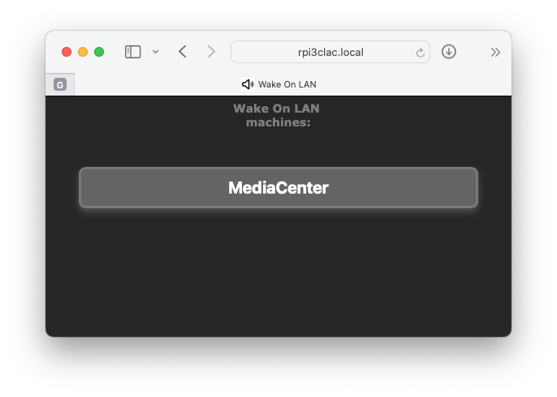

# A wake-on-lan web

If you have a 24x7 Raspberry Pi kind of Linux based micro PC running at home, you may want to use it as a WOL server to power on some local machines.

On your 24x7 micro PC you'll need:

- `sudo apt install wakeonlan`

- git clone this repo, for example under your `Downloads` folder, then copy all the repo `bin/*` stuff inside your `~/bin/` folder

        cd Downloads
        git clone https://github.com/Rsantct/wakeonlan_web.git
        cd
        cp -r  Downloads/wakeonlan_web/bin/*  bin/

- Adjust the apache conf file to point to your USER HOME

        sudo cp Downloads/wakeonlan_web/bin/wolserver/apache-site/wol.conf /etc/apache2/sites-available/
        sudo nano /etc/apache2/sites-available/wol.conf

- Enable the apache site:

        sudo a2ensite   wol.conf
        sudo service apache2 reload

- Configure the MAC address of your devices

        nano ~/bin/wolservice/wolservice.cfg

- Autorun the server, for example inside `/etc/rc.local`

        su -l YOURUSERHERE -c "python3 /home/YOURUSERHERE/bin/wolserver.py" &

Then, simply bookmark `http://microPC_IP:8081` on your favourite smartphone or tablet web browser.

