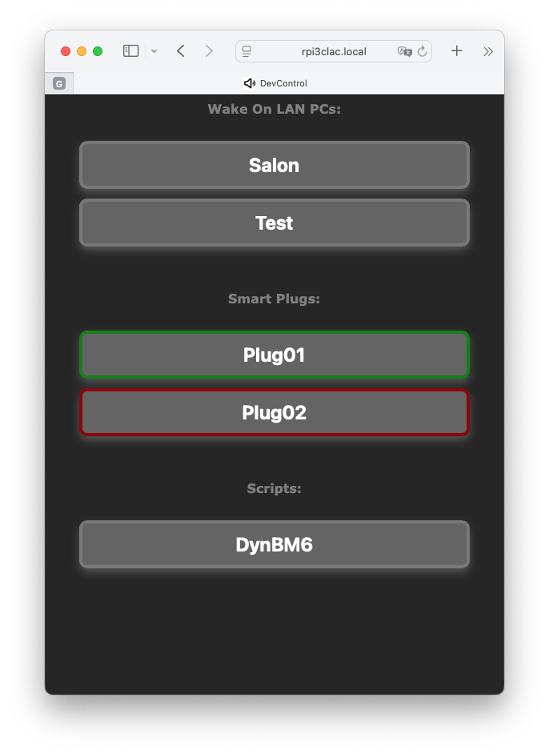

# A very simple Home Automation app

If you have a 24x7 Raspberry Pi kind of Linux based micro PC running at home, you may want to use it as a Home Automation server.

Features
- WOL sender to power on some PCs
- Smart Plugs controller
- Scripts

On your 24x7 micro PC you'll need:

- `sudo apt install wakeonlan`

- git clone this repo, for example under your `Downloads` folder, then copy all the repo `bin/*` stuff inside your `~/bin/` folder

        cd Downloads
        git clone https://github.com/Rsantct/DevControl.git
        cd
        cp -r  Downloads/DevControl/bin/*  bin/

- Adjust the apache conf file to point to your USER HOME

        sudo cp Downloads/DevControl/bin/devcontrol/apache-site/devcontrol.conf /etc/apache2/sites-available/
        sudo nano /etc/apache2/sites-available/devcontrol.conf

- Enable the apache site:

        sudo a2ensite devcontrol.conf
        sudo service  apache2 reload

- Configure the MAC address of your WOL devices and other stuff

        nano ~/bin/devcontrol/devcontrol.cfg

- Autorun the server, for example inside `/etc/rc.local`

        su -l YOURUSERHERE -c "python3 /home/YOURUSERHERE/bin/devcontrol.py" &

Then, simply bookmark `http://microPC_IP:8081` on your favourite smartphone or tablet web browser.

